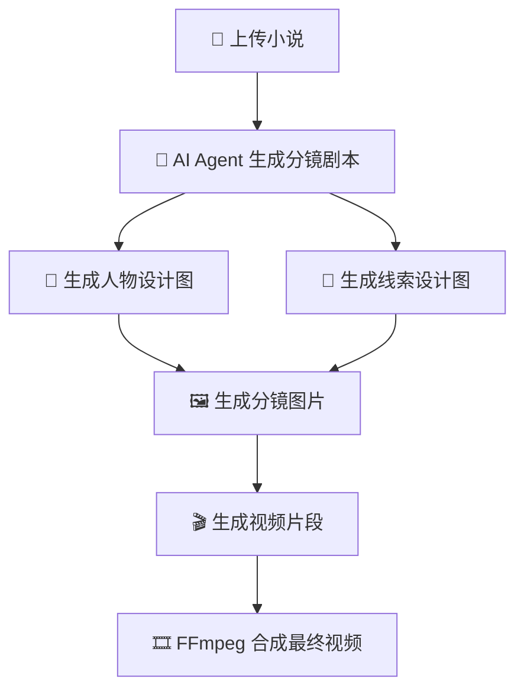
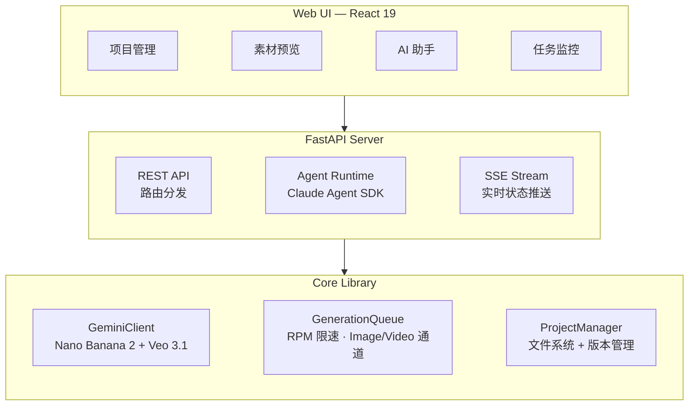

<h1 align="center">
  <br>
  <picture>
    <source media="(prefers-color-scheme: light)" srcset="frontend/public/android-chrome-maskable-512x512.png">
    <source media="(prefers-color-scheme: dark)" srcset="frontend/public/android-chrome-512x512.png">
    
  </picture>
  <br>
  ArcReel
  <br>
</h1>

<h4 align="center">开源 AI 视频生成工作台 — 从小说到短视频，全程 AI Agent 驱动</h4>
<h5 align="center">Open-source AI Video Generation Workspace — Novel to Short Video, Powered by AI Agents</h5>

<p align="center">
  <a href="#快速开始"></a>
  <a href="https://github.com/ArcReel/ArcReel/blob/main/LICENSE"></a>
  <a href="https://github.com/ArcReel/ArcReel"></a>
  <a href="https://github.com/ArcReel/ArcReel/pkgs/container/arcreel"></a>
</p>

<p align="center">
  
  
  
  
  
  
</p>

<p align="center">
  
</p>

---

## 核心能力

<table>
<tr>
<td width="20%" align="center">
<h3>🤖 AI Agent 工作流</h3>
基于 <strong>Claude Agent SDK</strong>，Skill + Subagent 多智能体协作，自动完成从剧本创作到视频合成的完整流水线
</td>
<td width="20%" align="center">
<h3>🎨 Nano Banana 2 图像生成</h3>
Gemini 最新图像模型驱动，人物设计图确保角色一致性，线索追踪保证道具/场景跨镜连贯
</td>
<td width="20%" align="center">
<h3>🎬 Veo 3.1 视频生成</h3>
Google 最新视频模型，以分镜图作为起始帧生成 4-8 秒视频片段，再由 FFmpeg 合成完整作品
</td>
<td width="20%" align="center">
<h3>⚡ 异步任务队列</h3>
RPM 速率限制 + Image/Video 独立并发通道，lease-based 调度，支持断点续传
</td>
<td width="20%" align="center">
<h3>🖥️ 可视化工作台</h3>
Web UI 管理项目、预览素材、版本回滚、实时 SSE 任务追踪，内置 AI 助手
</td>
</tr>
</table>

## 工作流程



## 功能特性

- **完整生产流水线** — 小说 → 剧本 → 人物设计 → 分镜图片 → 视频片段 → 成片，一键编排
- **多智能体架构** — Skills 处理单步任务（生成人物/分镜/视频），Subagent 处理复杂多步骤推理（剧本创作）
- **人物一致性** — AI 先生成人物设计图，后续所有分镜和视频均参考该设计
- **场景连贯** — 分镜图自动参考上一张生成，确保相邻场景画面衔接自然
- **线索追踪** — 关键道具、场景元素标记为"线索"，跨镜头保持视觉连贯
- **版本历史** — 每次重新生成自动保存历史版本，支持一键回滚
- **费用统计** — 自动记录 API 调用次数与费用，精确到每个任务
- **项目导入/导出** — 整个项目打包归档，方便备份和迁移
- **竖屏优化** — 默认 9:16 比例，适合短视频平台发布

## 快速开始

### 默认部署（SQLite）

```bash
# 1. 克隆项目
git clone https://github.com/ArcReel/ArcReel.git
cd ArcReel/deploy

# 2. 配置环境变量
cp .env.example .env

# 3. 启动服务
docker compose up -d

# 访问 http://localhost:1241
```

### 生产部署（PostgreSQL）

```bash
cd ArcReel/deploy/production

# 配置环境变量（需设置 POSTGRES_PASSWORD）
cp .env.example .env

docker compose up -d
```

首次启动后，前往 **设置页**（`/settings`）配置 Gemini API Key 等参数即可开始使用。

> **部署提示**：若使用 Seedance (火山方舟) 作为视频供应商，部署环境必须是公网可访问的，因为 Seedance 图片上传需要在公网地址上进行访问。

## 使用方式

通过 Web UI 工作台完成所有操作：

- **项目管理** — 创建项目、上传小说、管理多剧集
- **AI 助手** — 内置 AI 助手（Claude Agent SDK 驱动），对话式引导完成剧本创作、人物设计等
- **素材预览** — 人物图、分镜图、视频片段全屏预览
- **任务监控** — 实时查看生成任务进度（SSE 推送）
- **版本管理** — 每次重新生成自动保存历史，支持一键回滚
- **参数配置** — API Key、模型选择、速率限制等均可在页面配置

## 技术架构



## 技术栈

| 层级 | 技术 |
|------|------|
| **前端** | React 19, TypeScript, Tailwind CSS 4, wouter, zustand, Framer Motion, Vite |
| **后端** | FastAPI, Python 3.12+, SQLAlchemy 2.0 (async), Alembic, uvicorn, Pydantic 2 |
| **AI & 媒体** | Claude Agent SDK, Gemini API (Nano Banana 2 + Veo 3.1), FFmpeg, Pillow |
| **数据库** | SQLite (默认) / PostgreSQL (生产) |
| **部署** | Docker, Docker Compose（`deploy/` 默认, `deploy/production/` 含 PostgreSQL） |

## 文档

- 📖 [完整入门教程](docs/getting-started.md) — 从零开始的手把手指南
- 💰 [Google GenAI费用说明](docs/Google视频&图片生成费用参考.md) — API 调用费用参考

## 贡献

欢迎贡献代码、报告 Bug 或提出功能建议！

### 本地开发环境

```bash
# 前置要求：Python 3.12+, Node.js 20+, uv, pnpm, ffmpeg

# 安装依赖
uv sync
cd frontend && pnpm install && cd ..

# 初始化数据库
uv run alembic upgrade head

# 启动后端 (终端 1)
uv run uvicorn server.app:app --reload --port 1241

# 启动前端 (终端 2)
cd frontend && pnpm dev

# 访问 http://localhost:5173
```

### 运行测试

```bash
# 后端测试
python -m pytest

# 前端类型检查 + 测试
cd frontend && pnpm check
```

## 许可证

[AGPL-3.0](LICENSE)

---

<p align="center">
  如果觉得项目有用，请给个 ⭐ Star 支持一下！
</p>
